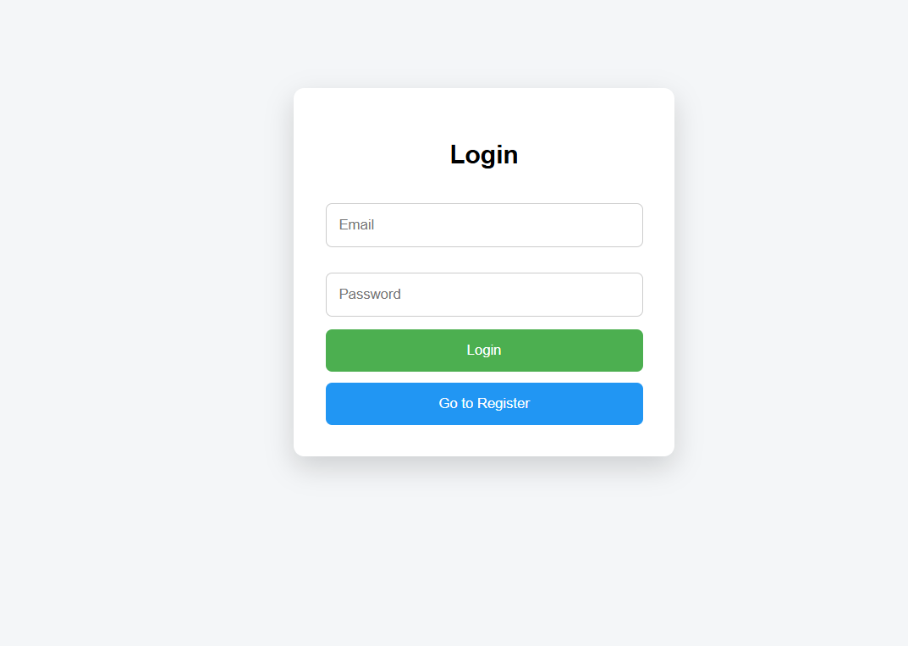
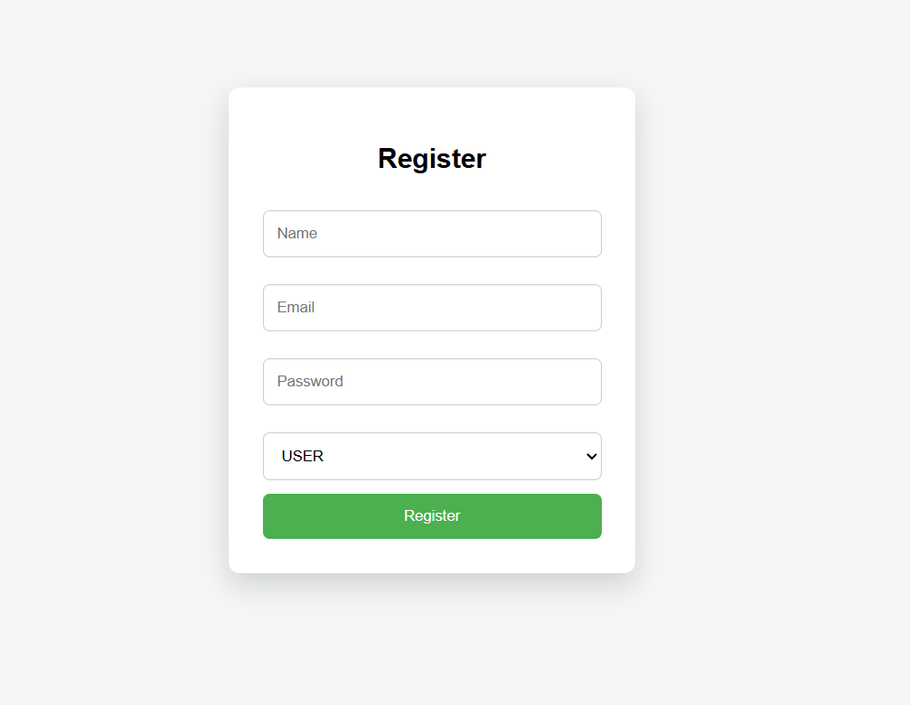
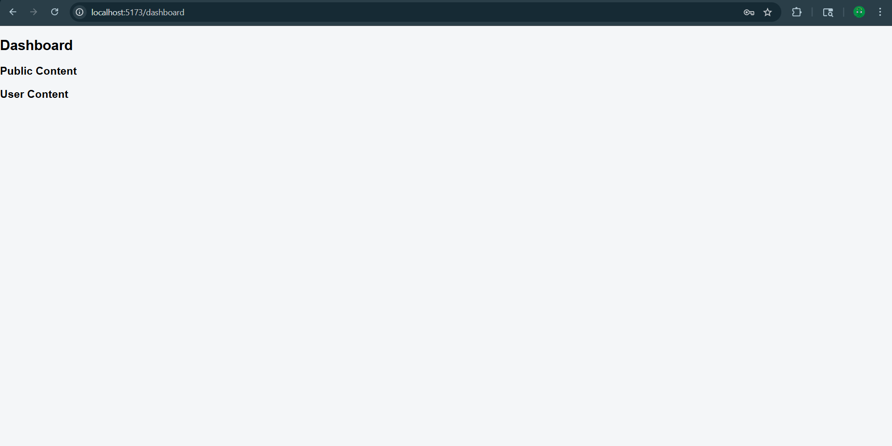
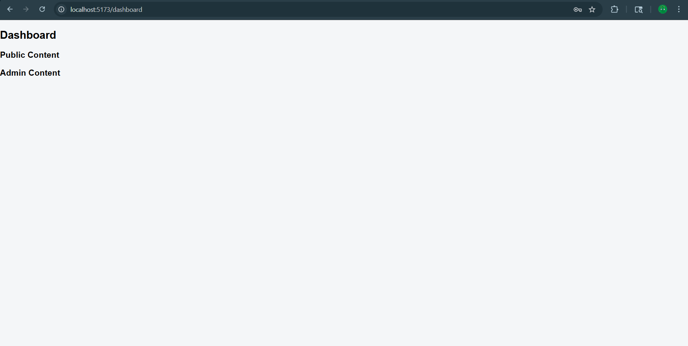

# Full Stack JWT Authentication & Role-Based Access Control System
A secure full-stack web application implementing JWT authentication and role-based authorization using Spring Boot and React.

##  Overview

This project is a full-stack web application implementing **JWT-based authentication** and **Role-Based Access Control (RBAC)** using:

* **Backend:** Java Spring Boot
* **Frontend:** React (Vite)
* **Database:** MySQL

Users can register, log in, and access content based on their assigned roles (**USER / ADMIN**).


##  Features

### Authentication

* User Registration (Name, Email, Password, Role)
* User Login with JWT Token generation
* Password encryption using BCrypt
* Stateless authentication (no sessions)

### Authorization (RBAC)

* **USER** → Access user-specific APIs
* **ADMIN** → Access admin-specific APIs
* Protected endpoints using Spring Security

### Frontend

* Login & Register forms
* JWT stored in localStorage
* Axios interceptor for attaching token
* Role-based UI rendering


## Tech Stack

### Backend

* Java 17
* Spring Boot
* Spring Security
* JWT (JJWT)
* Spring Data JPA (Hibernate)
* MySQL

### Frontend

* React (Vite)
* Axios
* React Router
* React Hook Form


##  Setup Instructions

### 1. Clone Repository

```bash
git clone https://github.com/prajapati-meet/Botmaker.git
cd project-folder
```


### 2. Backend Setup (Spring Boot)

#### Configure Database

Update `application.properties`:

```properties
spring.datasource.url=jdbc:mysql://localhost:3306/auth_db
spring.datasource.username=root
spring.datasource.password=your_password
spring.jpa.hibernate.ddl-auto=update

```

#### Run Backend

* Open project in **STS / IntelliJ**
* Run main class:

```bash
mvn clean install
```

* Start application

Backend runs on:

```
http://localhost:8080
```


### 3. Frontend Setup (React)

```bash
cd Botmakers_frontend/Botmaker
npm install
npm run dev
```

Frontend runs on:

```
http://localhost:5173
```


## API Endpoints

### Public

* `POST /auth/register`
* `POST /auth/login`
* `GET /api/public`

### User

* `GET /api/user` (Requires USER role)

### Admin

* `GET /api/admin` (Requires ADMIN role)


## Authentication Flow

1. User registers with role
2. User logs in → receives JWT token
3. Token stored in localStorage
4. Token sent in headers:

   ```
   Authorization: Bearer <token>
   ```
5. Backend validates token using filter
6. Access granted based on role


## Key Concepts Used

* Stateless Authentication (JWT)
* Spring Security Filters
* Role-Based Authorization
* Password Encryption (BCrypt)
* REST API Design


## Screenshots

### Login Page


### Register Page


### User Dashboard


### Admin Dashboard



## Demo Video 

[Click here to watch demo](https://drive.google.com/file/d/1vgEoKem3cJczqx-b719_Jd96plnwAl_k/view?usp=drive_link)


##  Author

Prajapati Meet Ketankumar

